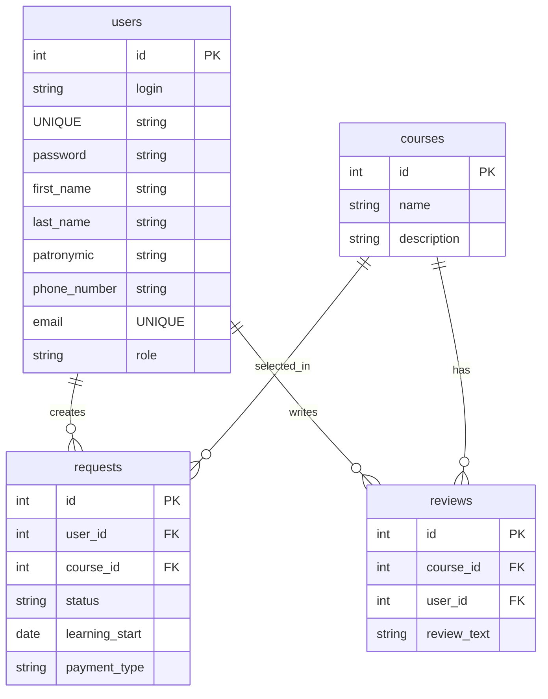

# Учусь.РФ

## Быстрый запуск

1. Установить Python 3.11+.
2. Перейти в корень проекта.
3. Создать и активировать виртуальное окружение.
4. Установить зависимости.
5. Инициализировать базу данных SQL-скриптами.
6. Запустить приложение.

Пример команд для Windows PowerShell:

```powershell
cd d:\Developing\Projects\Python\demo
python -m venv .venv
.\.venv\Scripts\Activate.ps1
pip install fastapi uvicorn jinja2 python-multipart itsdangerous
# Или
pip install -r requirements.txt
```

## SQL-скрипты, обязательные для работоспособности

Выполнять в строгом порядке:

1. `create_tables.sql` - создаёт таблицы.
2. `courses_insert.sql` - заполняет таблицу курсов.
3. `create_admin.sql` - создаёт/обновляет администратора по ТЗ (`Admin26` / `Demo20`).

Если используете консоль `sqlite3`, пример:

```powershell
sqlite3 demo.db ".read create_tables.sql"
sqlite3 demo.db ".read courses_insert.sql"
sqlite3 demo.db ".read create_admin.sql"
```

Если `sqlite3` CLI не установлен, можно выполнить SQL через любой GUI-клиент SQLite (DB Browser for SQLite, DBeaver) в том же порядке.

## Доступ администратора

После обязательного выполнения `create_admin.sql` используется фиксированный доступ по ТЗ:

- Логин: `Admin26`
- Пароль: `Demo20`

## Запуск сервиса

```powershell
python -m app.main
```

После запуска открыть:

- `http://127.0.0.1:8000/auth/login`
- `http://127.0.0.1:8000/auth/register`

## Технологический стек

- Backend: FastAPI, Starlette SessionMiddleware.
- Frontend: Jinja2 templates, HTML5, CSS3, JavaScript.
- База данных: SQLite.
- Библиотеки UI: Swiper (слайдер на странице профиля).

## Структура проекта

- `app/main.py` - сборка приложения и подключение роутеров.
- `app/modules/auth.py` - вход, регистрация, logout.
- `app/modules/profile.py` - личный кабинет, заявки, отзывы.
- `app/modules/admin.py` - панель администратора и смена статусов.
- `app/templates/` - HTML-шаблоны страниц.
- `app/static/styles/` - стили.
- `app/static/scripts/` - клиентские скрипты.
- `create_tables.sql`, `courses_insert.sql`, `create_admin.sql` - SQL-инициализация.

## Диаграмма базы данных



## Краткое пояснение по каждому критерию

### Блок 1

- 1.1: Полный стек реализован: API на FastAPI (`app/main.py`, `app/modules/*.py`), шаблоны/стили/скрипты (`app/templates`, `app/static`), БД SQLite (`app/database.py`, SQL-скрипты).
- 1.2: Для максимальной оценки нужны локальный git-репозиторий и осмысленные коммиты (организационный критерий, подтверждается историей git).
- 1.3: Панель администратора реализована в `app/modules/admin.py` + `app/templates/admin.html` (просмотр заявок, смена статусов).
- 1.4: Предметная область обучения/заявок выдержана: курсы, заявки, статусы, отзывы (`courses`, `requests`, `reviews`).
- 1.5: Использованы несколько языков: Python, SQL, HTML, CSS, JavaScript.
- 1.6: Код модульный и читаемый (роутеры разделены по доменам), применена объектная модель фреймворка FastAPI (ASGI-приложение, роутеры, шаблонизатор).
- 1.7: Страницы авторизации и регистрации есть, поля и переходы между ними реализованы (`app/templates/auth/login.html`, `app/templates/auth/register.html`).
- 1.8: Интерфейс просмотра/создания заявок реализован в `app/templates/profile.html` и поддержан серверной логикой в `app/modules/profile.py`.
- 1.9: Структура системы соответствует заданию: отдельные модули, шаблоны, статика, SQL-инициализация.

### Блок 2

- 2.1: Дизайн ориентирован на учебный сервис: чистая структура, понятные формы, акцент на карточках заявок и статусах.
- 2.2: Слайдер реализован через Swiper (`app/static/scripts/slider.js`, `app/templates/profile.html`).
- 2.3: Используется ограниченная палитра из руководства: `#007bff`, `#0d47a1`, `#ced4da`, `#dee2e6`, `#ffffff`.
- 2.4: Единый визуальный стиль обеспечен общими стилями в `app/static/styles/base.css`.
- 2.5: Иерархия шрифтов сохранена: `h1=36`, `h2=24`, `h3=18`, `p=16`, `span=12` (`base.css`).
- 2.6: Изображения применяются в слайдере профиля (`app/static/assets/*`, `profile.html`).
- 2.7: Адаптивность под мобильные экраны через media queries в `base.css`, `auth.css`, `profile.css`, `admin.css`.
- 2.8: Использование графического редактора подтверждается процессом подготовки медиа вне кода; в проекте подготовленные файлы уже подключены.

### Блок 3

- 3.1: Адаптивная верстка реализована для всех основных страниц (`auth`, `profile`, `admin`).
- 3.2: Валидация регистрации реализована на клиенте: `required`, `minlength`, `maxlength`, `pattern`, `type=email/tel`.
- 3.3: База данных и CRUD-функции работают: создание пользователей/заявок/отзывов, смена статусов.
- 3.4: Диаграмма БД приведена в этом README (Mermaid), связи соответствуют SQL-структуре.
- 3.5: Используются фреймворк и библиотека: FastAPI и Swiper.
- 3.6: Интерфейс дружественный: понятная навигация, подсказки в формах, читаемые карточки.
- 3.7: Управление статусами заявок администратором реализовано в `update_request_status` (`app/modules/admin.py`).
- 3.8: Анимации добавлены по всему приложению: плавное появление страниц, карточек, форм и интерактивных элементов (`base.css`, `auth.css`, `profile.css`, `admin.css`).
- 3.9: Верстка соответствует стандартам HTML5, классы именованы последовательно (`block__element`), присутствуют комментарии в ключевых местах.

### Блок 4

- 4.1: Пользовательский интерфейс реализован по современным стандартам HTML5/CSS3 и адаптивной верстки.
- 4.2: Информация логично сгруппирована: навигация, формы, список заявок, блоки администратора.
- 4.3: Интуитивная навигация добавлена в общий topbar (`app/templates/base.html`).
- 4.4: Колористика и композиция выстроены вокруг единой палитры и контрастной иерархии.
- 4.5: Технические требования к интерфейсной графике закрываются адаптивом и корректным масштабированием через `meta viewport`.
- 4.6: Макеты всех обязательных страниц реализованы: login, register, profile, admin.
- 4.7: Графические элементы подготовлены и использованы в UI (слайдер/изображения, кнопки, карточки, состояния).

## Примечание по проверке

При защите/оценке рекомендуется демонстрировать:

1. Регистрацию нового пользователя.
2. Создание заявки в профиле.
3. Смену статуса заявки в админ-панели.
4. Появление формы отзыва после статуса `Обучение завершено`.
